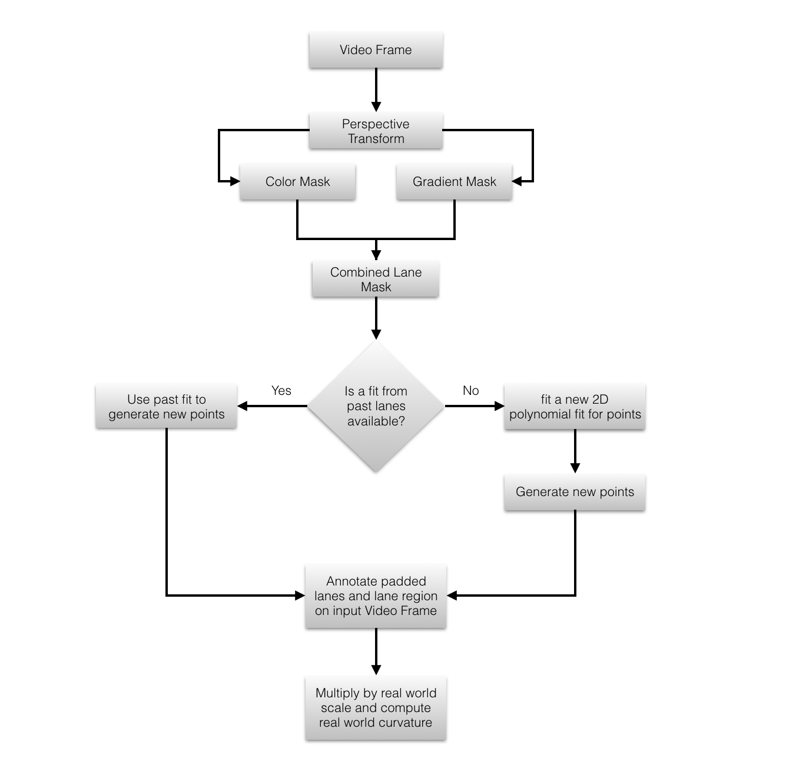

# CarND P4: Advanced Lane finding
The goals / steps of this project are the following:

* Compute the camera calibration matrix and distortion coefficients given a set of chessboard images.
* Apply a distortion correction to raw images.
* Use color transforms, gradients, etc., to create a thresholded binary image.
* Apply a perspective transform to rectify binary image ("birds-eye view").
* Detect lane pixels and fit to find the lane boundary.
* Determine the curvature of the lane and vehicle position with respect to center.
* Warp the detected lane boundaries back onto the original image.
* Output visual display of the lane boundaries and numerical estimation of lane curvature and vehicle position.

### 1. Loading the images
A simple method to load the images is defined. This method is used to load both the calibration as well as the test images
The method to load images is defined as load_images(names_path, names_list)

### 2. Calibrating the camera
All the calibration images are loaded. The grid is a non conventional 9x6 grid.
The Flowchart for Camera calibration is illustrated below.

The Source Code is available in cells 3-5 of the Jupyter Notebook

### 3. Calculating the Perspective Transform
The Inverse perspective transform is calculated using the four point method. An image is chosen deliberately with straight lanes so that the points are empirically tuned to get parallel lane lines and verify the IPM Visually.

The Source Code for Calculating the Perspective and Inverse Perspective Matrices is available in cell 7 of the Jupyter Notebook

### 4. Color space segmentation
HLS and LAB spaces were used to reliably separate lane markings based on color.
The Flowchart is presented below

The Method for this Function is defined as color_pipeline in the code (Jupyter Notebook)

### 5. Gradient based Segmentation
A sobel filter with x gradient only was used. The gradient based segmentation is to be performed on the top view (perspective transformed ) images so only a magnitude gradient in the x direction is relevant to the problem.
The Method for this Function is defined as gradient_pipeline in the code (Jupyter Notebook)

### 6. Combination of Masks
The Masks are combined using a simple or combination. The underlying assumption is that either gradient or Color space segmentation should be able to pick up the lane markers.

### 7. Detect and track lanes
The lane mask created by the combination of the gradient and the color masks is used to extract lane points by using the sliding window based approach on the histogram. The frame is vertically divided into 12 parts. and a moving window approach as instructed in the project help materials.

The Method for this is defined as lane_finder(binary_image, left, right)

### 8. Test and Visualize the Lane Marking pipeline
The Entire Pipeline as described above, is tested on all the test images for the purpose of testing and tuning

The Source Code is available in cell 20 of the Jupyter notebook

### 9. Working with Video
The Pipeline after proper testing and tuning was used to annotate the video. The Flowchart is presented below

The method for this is defined as annotate_frame in the Jupyter Notebook

### 10. Example Image

